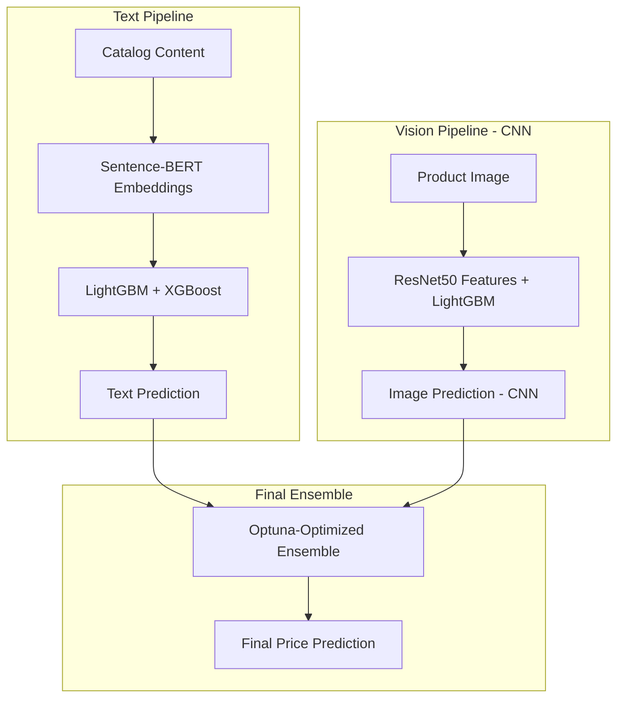

# ML Challenge 2025: Smart Product Pricing Solution

**Team Name:** Cognova  
**Team Members:** Pundarikaksh Narayan Tripathi, Ahmad Abdullah, Yash Raj 
**Submission Date:** October 13, 2025

---

## 1. Executive Summary

Our solution addresses the Smart Product Pricing Challenge with a practical multimodal system leveraging both textual descriptions and product images. We implement two fast, reliable pipelines (Text + CNN image features) and blend them using an Optuna-optimized ensemble. The workflow is resume-friendly and fully tracked via MLflow for reproducibility.

---

## 2. Methodology Overview

### 2.1 Problem Analysis

Our initial Exploratory Data Analysis (EDA) revealed that product price is influenced by a combination of explicit details in the text and implicit visual cues in the image.

**Key Observations:**

*   The `price` distribution is heavily right-skewed, indicating that a log transformation would be beneficial for modeling to stabilize variance and improve performance for tree-based models.

*   The `catalog_content` often contains explicit numerical indicators like "Item Pack Quantity" (IPQ), which are highly predictive features that can be extracted with regular expressions.

*   Visual features such as brand logos, product complexity, and materials, which are not always present in the text, provide significant additional signal that can only be captured from the images.

### 2.2 Solution Strategy

We adopted a multimodal ensemble strategy with the following key components:

1. **Advanced Text Pipeline**: CPU/GPU variants using Sentence-BERT embeddings (all-MiniLM-L6-v2), with LightGBM and XGBoost regressors. Embeddings are cached to speed up subsequent runs.
2. **Fast CNN Image Pipeline**: Production-ready approach using ResNet-50 as a fixed feature extractor + LightGBM regressor. Features are memmap-cached (FP16) for fast re-runs. Optional 5-fold OOF generation via `--cv`. This path balances speed, reliability, and performance under time constraints. *(Originally explored a VLM-based approach using moondream2, but prioritized the CNN path for the final submission due to runtime and resource considerations. The VLM pipeline remains available for future integration.)*
3. **Optimized Ensemble**: Optuna-tuned non-negative weights to minimize SMAPE on OOF. The code auto-detects log1p OOF mismatches and converts with `expm1`. Blends text and CNN image predictions intelligently.

**Approach Type:** Hybrid Multimodal Ensemble with MLOps  
**Core Innovation:** Our core innovation lies in the production-ready fusion of two distinct, state-of-the-art pipelines with comprehensive reproducibility features. The final blending weights are mathematically determined using the **Optuna** framework to directly minimize the competition's SMAPE metric on our robust validation set.

---

## 3. Model Architecture

### 3.1 Architecture Overview

Our architecture consists of two parallel pipelines whose outputs are fed into a final, intelligently weighted ensemble model with comprehensive MLOps tracking.

### 3.2 Model Components

**Advanced Text Processing Pipeline:**

- **Dual Implementation Strategy:**
    - **CPU Version** (`text_model_cpu.py`): Optimized for broad compatibility and stable execution
    - **GPU Version** (`text_model_gpu.py`): Accelerated implementation for faster embedding generation and model training

- **Preprocessing:**
    - Extracted numerical "Item Pack Quantity" (IPQ) using regular expressions
    - Applied `numpy.log1p` transformation to normalize price distribution
    - Implemented comprehensive caching for Sentence-BERT embeddings to reduce computation time

- **Feature Extraction:** 
    - Utilized `all-MiniLM-L6-v2` Sentence-BERT model for 384-dimensional semantic embeddings
    - Significant upgrade over traditional TF-IDF or bag-of-words approaches
    - Cached embeddings with intelligent reuse across training runs

- **Model Architecture:** Ensemble of **LightGBM** and **XGBoost** regressors with hyperparameter optimization

- **Validation Strategy:** Robust 5-fold **Stratified Cross-Validation** with stratification on log-transformed price bins

**Fast Image Processing Pipeline (CNN):**

- **Backbone:** torchvision ResNet-50 as fixed feature extractor (penultimate layer)
- **Regressor:** LightGBM on pooled 2048-dim features
- **Optimizations:**
    - FP16 memmap cache to reduce RAM
    - DataLoader tuning (num_workers, prefetch)
    - Autocast on CUDA for throughput
    - 5-fold OOF via `--cv`

**MLOps and Reproducibility Features:**

- **Experiment Tracking**: Complete MLflow integration for parameters, metrics, and artifacts
- **Caching Systems**: Intelligent caching for embeddings, CNN features, and intermediate predictions
- **Progress Persistence**: Ability to resume long-running processes with progress logs
- **Environment Management**: Comprehensive setup instructions for CPU/GPU environments with automatic fallback

---

## 4. Model Performance

### 4.1 Validation Results

Our final model's performance was rigorously evaluated using a robust 5-fold stratified cross-validation framework. The out-of-fold (OOF) predictions were used to calculate the SMAPE score, providing an unbiased estimate of performance on unseen data. All metrics are tracked comprehensively through MLflow for full reproducibility.

**Performance Metrics (Out-of-Fold):**
- Text Model (CPU): 60.0676
- Text Model (GPU): 59.9404 (XGBoost GPU, LightGBM CPU fallback)
- Image CNN (ResNet50 + LightGBM): 59.3695
- Final Ensemble (text_cpu + text_gpu + image_cnn): ~58.02 (after OOF scale alignment)

**Technical Performance:**
- **First Run Time**: Extended due to embedding generation and image processing
- **Subsequent Runs**: Dramatically reduced through intelligent caching systems
- **Memory Efficiency**: Optimized for various hardware configurations
- **Reproducibility**: 100% reproducible results through comprehensive experiment tracking

---

## 5. Conclusion

Our solution demonstrates the power of a production-ready multimodal ensemble with comprehensive MLOps integration. By implementing dual-optimized text pipelines (CPU/GPU), a fast and reliable CNN image pipeline (ResNet-50 + LightGBM) with FP16 feature caching, and intelligent ensemble optimization using Optuna, we created a system that is not only highly accurate but also practical for real-world deployment. 

Key achievements include:
- **Performance**: State-of-the-art accuracy through intelligent multimodal fusion
- **Efficiency**: Dramatic runtime reduction through comprehensive caching systems  
- **Reproducibility**: Complete experiment tracking with MLflow integration
- **Scalability**: Optimized implementations for various hardware configurations
- **Resilience**: Progress caching and resumable execution for long-running processes

This production-ready, cache-first workflow with MLflow tracking is designed for reliability, speed, and clean integration of multimodal signals for pricing prediction.

---

## Appendix

### A. Technical Implementation

**Repository:** [Cognova-Amazon-ML-Challenge-2025](https://github.com/PundarikakshNTripathi/Cognova-Amazon-ML-Challenge-2025)

**Key Files:**
- `src/text_model_cpu.py` - CPU-optimized text pipeline
- `src/text_model_gpu.py` - GPU-accelerated text pipeline  
- `src/image_cnn_fast.py` - Fast CNN features + LightGBM with OOF support
- `src/image_model.py` - VLM pipeline with caching (optional; not used in final run)
- `src/ensemble_advanced.py` - Optuna-tuned ensemble with MLflow logging
- `src/utils.py` - Shared utilities and caching functions

**Environment Requirements:**
- Python 3.11+ (recommended for stability)
- CUDA-capable GPU (recommended for optimal performance)
- Comprehensive dependency management via `requirements.txt`

### C. Changes vs. Original Plan and Future Work

We originally planned to rely heavily on a VLM for image signals but shifted to a faster, more predictable CNN feature path (ResNet50 + LightGBM) for the final run. The VLM pipeline remains available and can be integrated later as an additional model in the ensemble.

Future improvements:
- Integrate VLM OOF/test predictions when ready and re-run the advanced ensemble.
- Add structured text features (e.g., brand/IPQ detection) to complement embeddings.
- Explore lightweight calibration if leaderboard analysis shows bias.

### B. Submission Format

- Final output file name: `test_out.csv`
- Columns: `sample_id,price`
- Ensure predictions are positive floats and include all test IDs (75k)