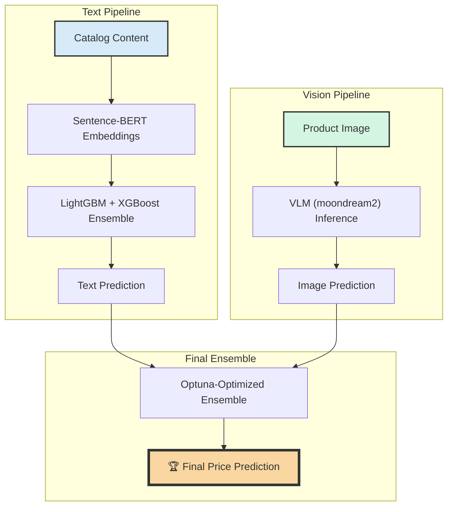

# Cognova - Amazon ML Challenge 2025

<p align="center">


</p>

<p align="center">
<strong>Team Cognova's official submission for the Amazon ML Challenge 2025: Smart Product Pricing</strong>
</p>

## 📋 Project Overview

This project implements a state-of-the-art multimodal machine learning solution to predict product prices based on textual descriptions and product images. Our approach is a robust, two-pipeline system where predictions from each modality are intelligently combined using an optimized ensemble. This architecture is designed for high performance, rapid iteration, and reproducibility.

## 🔍 Key Features

1. **Advanced Text Pipeline**: An ensemble of LightGBM and XGBoost models trained on high-quality text features. We utilize Sentence-BERT embeddings (all-MiniLM-L6-v2) to capture the deep semantic meaning of product descriptions, a significant upgrade over traditional methods. The pipeline includes separate, optimized scripts for both CPU and GPU execution, allowing for flexibility and speed.

2. **Vision Language Model (VLM) Pipeline**: A cutting-edge approach using the moondream2 VLM for direct price prediction from product images. This model performs inference via carefully crafted prompts. The script is heavily optimized with batch processing for massive GPU speedup and progress caching to ensure resilience against interruptions.

3. **Optimized Ensemble Strategy**: The final predictions are a weighted average of our best text model(s) and the VLM. The script intelligently combines predictions from both CPU and GPU text models if available, creating a more robust baseline. The final blending weights are determined automatically using the Optuna hyperparameter optimization framework to directly minimize the competition's SMAPE metric on our local validation set.

4. **MLOps and Reproducibility**: The entire workflow is instrumented with MLflow for comprehensive experiment tracking of parameters, metrics, and artifacts. Caching mechanisms for embeddings and VLM predictions are implemented to drastically reduce runtimes after the initial execution.

## 🚀 Workflow & How to Run

### 1. Setup

#### Environment Setup
It is highly recommended to use a virtual environment. We recommend Python 3.11 for stability and compatibility with all libraries.

**Using Conda:**
```bash
# Create a new conda environment
conda create -n amc2025 python=3.11

# Activate the environment
conda activate amc2025
```

**Using venv (alternative):**
```bash
# Create a new virtual environment
python -m venv amc2025

# Activate the environment (Windows)
.\amc2025\Scripts\activate

# Activate the environment (macOS/Linux)
source amc2025/bin/activate
```

#### Project Setup
```bash
# Clone the repository
git clone https://github.com/PundarikakshNTripathi/Cognova-Amazon-ML-Challenge-2025.git

# Navigate to the project directory
cd Cognova-Amazon-ML-Challenge-2025

# Install dependencies
pip install -r requirements.txt
```

#### GPU Configuration (Highly Recommended)
For local GPU execution, ensure your environment is correctly configured:
1. **NVIDIA Driver**: Install the NVIDIA Studio Driver for optimal performance in computational tasks.
2. **GPU Mode**: If using a gaming laptop with a MUX switch (like NVIDIA Advanced Optimus), set the mode to "GPU Only" or "dGPU Mode" in your system's control software (e.g., OMEN Gaming Hub) and reboot. This guarantees that all scripts have access to the dedicated GPU.

### 2. Run Text Models (Local Machine)

These scripts generate text-based predictions. The first run will be long as it generates and caches embeddings. Subsequent runs will be much faster. You can run either or both.

To run the CPU version:
```bash
python src/text_model_cpu.py
```

To run the GPU version (recommended for speed):
```bash
python src/text_model_gpu.py
```

These scripts will create prediction files (e.g., `submission_text_cpu.csv`, `oof_text_preds_gpu.csv`) in the `submissions/` folder.

### 3. Run VLM Model (Local GPU or Colab)

This script uses the VLM for image-based inference. It is heavily optimized for a GPU.

**Local Execution (Recommended):**
Ensure your GPU is configured as described in the setup.
```bash
python src/image_model.py
```

The script will download images and cache its progress, so you can safely stop and restart it.

**Colab Fallback:**
If you encounter local memory issues, you can use Google Colab:
- Upload the `src/image_model.py`, `src/utils.py` scripts and the `data/` folder.
- Ensure the Colab runtime is set to a GPU (e.g., T4).
- Run `!pip install -r requirements.txt` in a cell.
- Run the script: `!python image_model.py`.
- After execution, download the generated `submissions/` folder and place its contents into your local `submissions/` folder.

### 4. Run Ensemble (Local Machine)

This script intelligently finds the best blend of all available model predictions and generates the final submission file.

```bash
python src/ensemble.py
```

This will create the final `final_ensemble_submission.csv` in the `submissions/` folder.

### 5. Sanity Check (Local Machine)

Run this script to ensure the final submission file is correctly formatted before uploading.

```bash
python src/sanity.py
```

## 🛠 Tech Stack

| Technology | Purpose |
|------------|---------|
| [Python](https://www.python.org/downloads/) | Core programming language |
| [PyTorch](https://pytorch.org/) | Deep learning framework for VLM & Embeddings |
| [Transformers](https://huggingface.co/docs/transformers/index) | Hugging Face library for VLM models |
| [LightGBM](https://lightgbm.readthedocs.io/en/latest/) | Gradient boosting framework for text model |
| [XGBoost](https://xgboost.ai/) | Gradient boosting framework for text model |
| [Sentence-BERT](https://www.sbert.net/) | State-of-the-art sentence embeddings |
| [Scikit-learn](https://scikit-learn.org/) | Machine learning utilities & validation |
| [Optuna](https://optuna.org/) | Hyperparameter optimization for ensembling |
| [MLflow](https://mlflow.org/) | Experiment tracking and MLOps |

## 📊 Model Architecture

Our architecture consists of two parallel pipelines whose outputs are fed into a final, intelligently weighted ensemble model.


## Performance Metrics (Out-of-Fold):

- **CPU Text Ensemble SMAPE:** 60.0676
  - LightGBM CPU: 60.8804
  - XGBoost CPU: 59.4842

- **GPU Text Ensemble SMAPE:** ~60.0 (LightGBM CPU + XGBoost GPU)
  - LightGBM CPU: 60.8804 (CPU fallback for stability)
  - XGBoost GPU: 59.2832

**Technical Notes:**
- GPU script uses CPU for LightGBM due to numerical precision issues on GPU
- XGBoost GPU provides reliable acceleration without stability concerns
- This hybrid approach maintains ensemble diversity while ensuring model quality

## 🏆 Results

The performance of each model component is tracked via a robust 5-fold stratified cross-validation strategy. The final scores are based on the out-of-fold (OOF) predictions.

| Model | SMAPE Score (OOF) |
|-------|-------------------|
| Text Model (CPU+GPU Avg) | TBD |
| VLM Model | TBD |
| Final Ensemble | TBD |

## 📄 Documentation

The final 1-page report for the judges can be found in `Documentation.md`.

## 👥 Team Cognova

- Pundarikaksh Narayan Tripathi
- Ahmad Abdullah
- Yash Raj

## 📝 License

This project is licensed under the Apache-2.0 License.